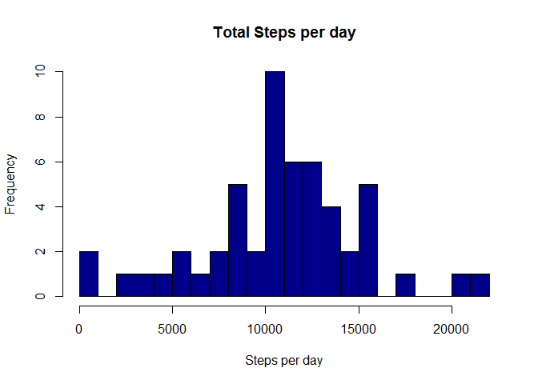
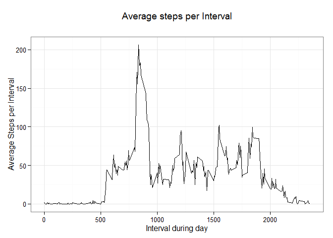
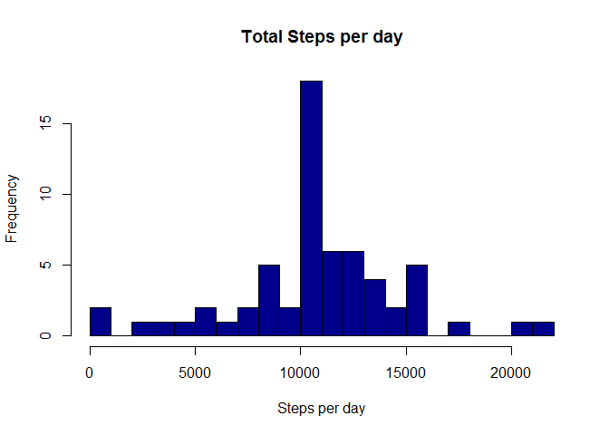
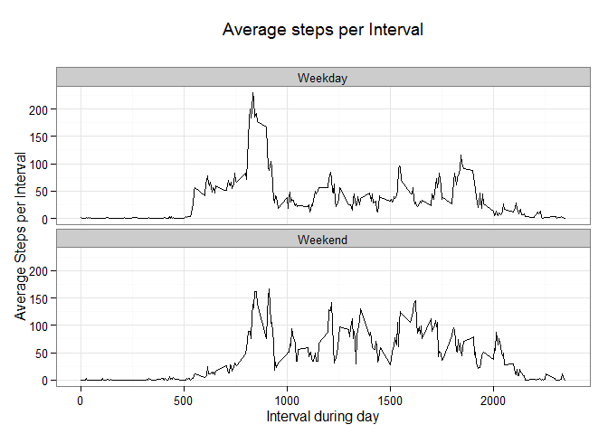

# Reproducible Research: Peer Assessment 1
Maria Ines Plaza Schwarck  
November 9, 2015  
## Introduction
This report consists in the analysis of the data of steps taken by a specific anonymous individual every 5-minutes. The data were collected during October and November 2012, and there are 17.568 records available to perform the analysis. The data have two dimensions: 5-minutes interval and date.  

The goal of the report is to understand the pattern of steps for this individual according to mentioned dimensions. The report is structured step-by-step, showing the code and the conclusions for every analysis. It  is divided in 6 parts:

1. Set-Up  
2. Data Preprocessing
3. Total number of steps taken per day
4. Daily activity pattern
5. Missing Values
6. Activity patterns between weekdays and weekends

## Set-up R before starting 

It is always convenient to start R codes with the setup of the R environment. This setup includes loading relevant libraries and set the working directory among other possible steps. 

```r
    list.of.packages <- c("plyr", "ggplot2")
    new.packages <- list.of.packages[!(list.of.packages %in% installed.packages()[,"Package"])]
    if(length(new.packages)) install.packages(new.packages)
    library(plyr)
    library(ggplot2)
    directory <-'' #Replace here your directory
```
My working directory is not showed to avoid to share personal information. 


```r
    setwd (directory)
```

## Loading and preprocessing the data
In order to start working with the data, a variable called: ActivityInfo with the information from the table is created. Since there is several data without proper information (missing values), this data is removed subsetting the data with !is.na command. 


```r
    ZipFile <-"activity.zip"
    unzip(ZipFile)
    ActivityInfo <- read.csv("activity.csv", stringsAsFactors = FALSE)
    ActivityInfoClean <- ActivityInfo[!is.na(ActivityInfo$steps),c("steps", "date", "interval")]
```

## Total number of steps taken per day

Using the data without missing values, a new dataframe called DataPlot is created. This dataframe summarise the total numbers of steps taken per day. After that the mean (10.766,19) and the median (10.765) of the data were calculated. A histogram is provided for further analysis. 


```r
    DataPlot <- ddply(ActivityInfoClean, "date", summarise, Total_Steps = sum(steps))
    hist(DataPlot$Total_Steps, breaks=20, main = "Total Steps per day", xlab = "Steps per day", col = "darkblue")
```

 

```r
    Original_Mean <- mean(DataPlot$Total_Steps, na.rm=FALSE)
    Original_Mean
```

```
## [1] 10766.19
```

```r
    Original_Median <- median(DataPlot$Total_Steps)
    Original_Median
```

```
## [1] 10765
```


## Daily activity pattern
The other dimension available in the dataset is the 5-minutes interval, that help us to understand in which moment of the day is the individual more active. To perform this second analysis, the original data (without missing values) is summarised by 5-minutes interval, calculating the average steps per interval across all the days. This data is plotted, and the data shows that the interval 835 is the interval with the highest average steps (206,1698). 

The detailed graph is provided for further analysis.

```r
   DataPlot2 <- ddply(ActivityInfoClean, "interval", summarise, Average_Steps = mean(steps))
    plot <- ggplot(DataPlot2, aes(interval, Average_Steps))  + geom_line(fill="darkblue", stat="identity") 
    plot <- plot + ggtitle(expression(atop("Average steps per Interval", "")))
    plot <- plot + labs(x="Interval during day",y="Average Steps per Interval") 
    plot <- plot + theme(panel.grid.major = element_line(colour = "white")) + theme_bw()
    plot
```

 

```r
    DataPlotOrdered <- DataPlot2[ order(-DataPlot2$Average_Steps),]
    DataPlotOrdered[1,]    
```

```
##     interval Average_Steps
## 104      835      206.1698
```

## Missing values
There are a lot of missing values. Specifically there are a total of 2.304 missing values that represents the 13.11% of the whole data. Since the missing data is greater than 5% it is convenient to define a strategy for filling the missing values in the dataset for a better analysis. 

The selected criteria is to replace the missing values by the average steps of the corresponding 5-minutes interval. Since the biggest 5-minutes interval correspond to 2.355 dividing by 5, it is obtained the number 471 used into the code. 

The histogram presented in section 3 is rebuilded and the mean (10.766,19) and median (10.766,19) of the new dataset is calculated for comparison purposes. Since the criteria used is very accurate, there is not relevant difference between mean and median but the dataset is more complete for graph purposes. 

```r
    sum(is.na(ActivityInfo$steps))
```

```
## [1] 2304
```

```r
    for (i in 0:471){
        ActivityInfo$steps[is.na(ActivityInfo$steps) & ActivityInfo$interval == 5*i] <- DataPlot2$Average_Steps[DataPlot2$interval == 5*i]    
    }
    DataPlot3 <- ddply(ActivityInfo, "date", summarise, Total_Steps = sum(steps))
    hist(DataPlot3$Total_Steps, breaks=20, main = "Total Steps per day", xlab = "Steps per day", col = "darkblue")
```

 

```r
    New_Mean <- mean(DataPlot3$Total_Steps, na.rm=FALSE)
    New_Mean
```

```
## [1] 10766.19
```

```r
    New_Median <- median(DataPlot3$Total_Steps)
    New_Median
```

```
## [1] 10766.19
```

```r
    Diff_Mean <- (Original_Mean - New_Mean)/Original_Mean
    Diff_Mean
```

```
## [1] 0
```

```r
    Diff_Median <- (Original_Median - New_Median)/Original_Median
    Diff_Median
```

```
## [1] -0.0001104207
```

## Activity patterns between weekdays and weekends
The dataset with the replaced missing values is used to perform an analysis of weekdays vs weekend. In order to do that a new column called DayType is created. After that, the data is summarised in DataPlot4 by 5-minutes interval and plotted by DayType facet to compare both patterns. 

After graphing both patterns, it is clear that this individual is more active during weekdays than weekends, and that the activity during weekends starts later than during weekdays.  Although it is important to note that the afternoons during the weekends are more active than weekdays. 


```r
    ActivityInfo$date <- as.Date(ActivityInfo$date)
    ActivityInfo$Weekday <- weekdays(ActivityInfo$date)
    ActivityInfo$DayType <-"Weekday"
    ActivityInfo$DayType[ActivityInfo$Weekday == "Saturday"] <- "Weekend"
    ActivityInfo$DayType[ActivityInfo$Weekday == "Sunday"] <- "Weekend"
    DataPlot4 <- ddply(ActivityInfo, c("interval","DayType"), summarise, Average_Steps = mean(steps))
    plot <- ggplot(DataPlot4, aes(interval, Average_Steps))  + facet_grid(.~DayType) + facet_wrap(~DayType, ncol=1) + geom_line(fill="darkblue", stat="identity") 
    plot <- plot + ggtitle(expression(atop("Average steps per Interval", "")))
    plot <- plot + labs(x="Interval during day",y="Average Steps per Interval") 
    plot <- plot + theme(panel.grid.major = element_line(colour = "white")) + theme_bw()
    plot
```

 
